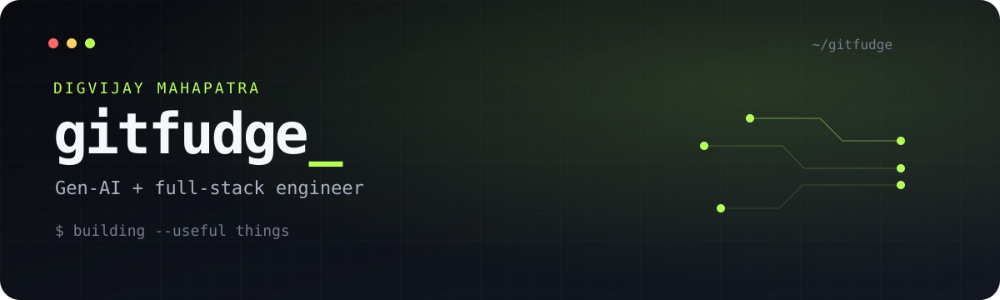

  

  
  
  
  

I build small, sharp tools for developers and the desktop—usually where **AI agents**, **Rust**, and an unreasonable amount of polish overlap.

Currently exploring local-first software, agentic workflows, and interfaces that stay out of the way.

### Selected builds

<table>
  <tr>
    <td width="50%" valign="top">
      <h3><a href="https://github.com/gitfudge0/kakomi">⌗ kakomi</a></h3>
      Frame it. Keep it. Capture page elements or custom areas, then style the result locally.
        <code>JavaScript</code> <code>Chrome</code> <code>Firefox</code>
    </td>
    <td width="50%" valign="top">
      <h3><a href="https://github.com/gitfudge0/grove">🌿 grove</a></h3>
      A worktree launchpad for running AI coding agents side by side in embedded sessions.
        <code>Rust</code> <code>Desktop</code> <code>AI tooling</code>
    </td>
  </tr>
  <tr>
    <td width="50%" valign="top">
      <h3><a href="https://github.com/gitfudge0/walt">◫ walt</a></h3>
      A keyboard-first wallpaper picker for Hyprland with instant previews and auto-rotation.
        <code>Rust</code> <code>Hyprland</code> <code>TUI</code>
    </td>
    <td width="50%" valign="top">
      <h3><a href="https://github.com/gitfudge0/brim">▰ brim</a></h3>
      One terminal dashboard for tracking Codex, Claude, and Copilot usage quotas.
        <code>Rust</code> <code>TUI</code> <code>Developer tools</code>
    </td>
  </tr>
  <tr>
    <td width="50%" valign="top">
      <h3><a href="https://github.com/gitfudge0/audora">♫ audora</a></h3>
      A native Android toolkit for cleaning up music metadata, lyrics, and artwork.
        <code>Kotlin</code> <code>Android</code> <code>Local-first</code>
    </td>
    <td width="50%" valign="top">
      <h3><a href="https://github.com/gitfudge0/innu">⌁ innu</a></h3>
      Minimal Wi-Fi management for the Linux desktop, built to feel native and fast.
        <code>Rust</code> <code>Linux</code> <code>Desktop</code>
    </td>
  </tr>
</table>

### The workbench

`Rust` · `Kotlin` · `TypeScript` · `React` · `Node.js` · `Linux` · `Android` · `AI agents`

  

Build the useful thing. Make it feel good. Ship it.

